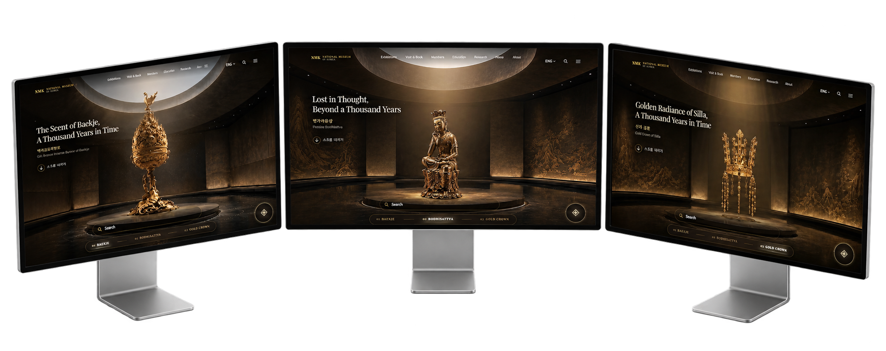
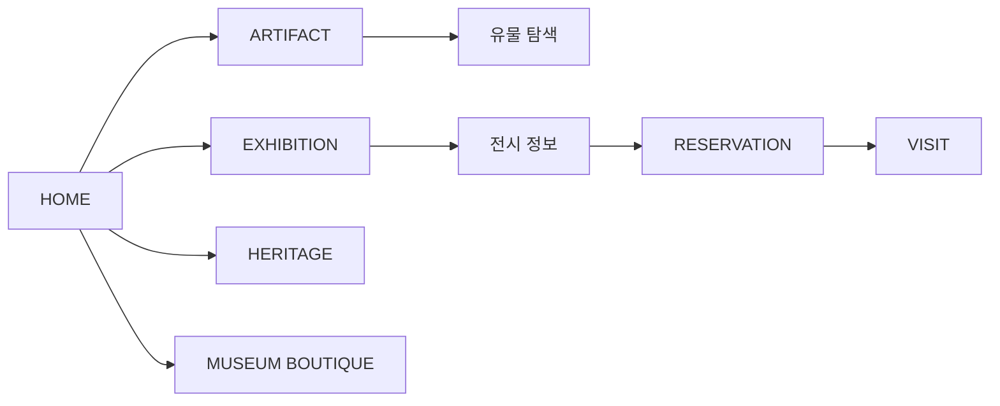

<div align="center">

# 🏛️ NATIONAL MUSEUM OF KOREA

### 천년의 시간을, 지금의 경험으로.

우리 문화유산을 단순히 보여주는 것을 넘어,  
**탐색하고 움직이며 경험할 수 있도록 재해석한 국립중앙박물관 웹사이트 리디자인 프로젝트**

[](https://github.com/zinnnnooooo/national-museum-of-korea)

<br>


</div>

---

## 💡 Project Overview

국립중앙박물관 웹사이트를 **정보 중심의 박물관 홈페이지에서 문화유산을 직접 경험하는 디지털 공간으로 확장**하는 것을 목표로 진행한 리디자인 프로젝트입니다.

유물, 전시, 관람, 예약, 문화상품 등 박물관의 다양한 콘텐츠를 하나의 경험으로 연결하고, 영상과 스크롤 기반 인터랙션을 활용해 **사용자가 웹사이트를 탐색하는 과정에서도 문화유산의 깊이와 아름다움을 느낄 수 있도록 설계했습니다.**

특히 전통적인 문화유산의 이미지와 현대적인 디지털 인터랙션을 결합해 **과거의 유산을 오늘의 방식으로 경험하는 웹사이트**를 구현하고자 했습니다.

---

## 🎯 Problem

### 박물관의 경험은 왜 웹사이트에 들어오는 순간 멈춰야 할까?

박물관 웹사이트는 전시 일정, 유물 정보, 관람 안내처럼 많은 정보를 제공해야 합니다.

하지만 정보 전달에만 집중하면 실제 박물관에서 느낄 수 있는 **유물의 존재감과 문화유산을 발견하는 경험**을 디지털 환경에서는 충분히 전달하기 어렵습니다.

특히 젊은 사용자와 디지털 환경에 익숙한 방문자에게는 단순한 정보 확인을 넘어 **직접 탐색하고 반응하며 몰입할 수 있는 경험**이 필요하다고 생각했습니다.

> **“박물관 웹사이트 자체가 하나의 디지털 전시 공간이 될 수는 없을까?”**

---

## 💡 Solution

| | 핵심 방향 | 내용 |
|:---:|---|---|
| 🗿 | **Artifact Experience** | 대표 유물을 시각적·인터랙티브 콘텐츠로 재구성 |
| 🎞️ | **Immersive Experience** | 영상과 스크롤 기반 연출로 몰입도 높은 탐색 경험 제공 |
| 🏛️ | **Museum UX** | 유물·전시·관람·예약·문화상품을 하나의 서비스로 연결 |
| ✨ | **Interactive Web** | 스크롤, 프레임 애니메이션, 커서 효과 등 인터랙션 활용 |
| 🤖 | **AI Vibe Coding** | AI와 자연어로 협업하며 디자인을 실제 웹사이트까지 구현 |

> ### **정보를 찾는 박물관 웹사이트에서, 문화유산을 경험하는 디지털 전시 공간으로.**

---

## 📱 Preview

<p align="center">
  
</p>

---

## ✨ Key Features

### 🗿 Artifact Experience

대표 유물을 단순한 이미지와 설명으로 보여주는 대신 **시각적 연출과 인터랙션을 통해 탐색할 수 있는 콘텐츠**로 구성했습니다.

유물 자체가 웹사이트의 주인공이 되도록 큰 이미지와 여백, 움직임을 활용해 문화유산의 디테일에 집중할 수 있도록 설계했습니다.

### 🎞️ Immersive Hero

Hero 영상과 프레임 기반 연출을 활용해 웹사이트에 처음 진입하는 순간부터 **일반적인 기관 홈페이지가 아닌 디지털 전시를 관람하는 듯한 첫인상**을 형성했습니다.

### 🖱️ Scroll-Based Interaction

스크롤에 따라 콘텐츠와 프레임이 변화하도록 구성해 사용자가 페이지를 단순히 읽는 것을 넘어 **직접 움직이며 콘텐츠를 발견하는 경험**을 만들었습니다.

### ✨ Interactive Cursor

Black & Gold 비주얼에 어울리는 **커스텀 커서와 Spark 효과**를 활용해 작은 사용자 행동에도 시각적인 반응을 제공합니다.

### 🖼️ Exhibition

전시 콘텐츠를 별도의 경험으로 구성해 사용자가 박물관의 전시와 관련 콘텐츠를 자연스럽게 탐색할 수 있도록 설계했습니다.

### 🎫 Reservation & Visit

디지털 콘텐츠 감상에서 끝나지 않고 **예약과 관람 정보까지 연결**해 실제 박물관 방문으로 이어질 수 있는 구조를 구성했습니다.

### 🛍️ Museum Boutique

문화상품을 독립적인 콘텐츠 경험으로 구성해 **유물 감상 → 전시 탐색 → 관람 → 문화상품**으로 이어지는 박물관 경험을 확장했습니다.

---

## 🎨 Visual & Interaction Design

### ⚫ Black & Gold

어두운 배경을 중심으로 유물에 시선이 집중되도록 구성하고 Gold 컬러를 포인트로 활용해 **문화유산이 가진 고급스러움과 역사적 분위기**를 현대적으로 표현했습니다.

### 🎬 Cinematic Motion

영상과 프레임 애니메이션을 활용해 정적인 기관 웹사이트보다 **영화적인 화면 전환과 몰입감**을 강화했습니다.

### ✨ Micro Interaction

Hover, Spark, Cursor 등 작은 인터랙션을 활용해 사용자의 행동에 웹사이트가 즉각적으로 반응하도록 설계했습니다.

---

## 🧭 Experience Flow



---

## 🛠️ Tech Stack

### Development

| Technology | Usage |
|---|---|
| **HTML5** | 페이지 구조 및 콘텐츠 구성 |
| **CSS3** | UI, 레이아웃, 비주얼 스타일링 |
| **JavaScript** | 인터랙션, 모션 및 사용자 경험 구현 |

### Design & AI

| Tool | Usage |
|---|---|
| **Figma** | UI/UX 디자인 및 화면 설계 |
| **ChatGPT** | 기획, 요구사항 구조화, 프롬프트 작성 |
| **Gemini** | 아이디어 구체화 및 AI 협업 |
| **Claude** | 구현 및 코드 개선 |
| **Antigravity** | AI 기반 바이브코딩 및 반복 구현 |

---

## 🤖 AI Vibe Coding Process

### 문화유산을 보는 경험에서, 움직이며 경험하는 웹사이트로.

```text
01. 기존 웹사이트 분석
        ↓
02. UX / 콘텐츠 구조 재설계
        ↓
03. Visual Concept 정의
        ↓
04. Figma UI 디자인
        ↓
05. AI 기반 개발 요구사항 정의
        ↓
06. 인터랙션 구현
        ↓
07. 테스트 & Re-Prompting
        ↓
08. 모션·인터랙션 고도화
        ↓
09. 최종 웹사이트 완성
```

AI를 단순한 코드 생성 도구가 아니라 **디자인에서 상상했던 움직임을 실제 웹 인터랙션으로 구현하는 협업 도구**로 활용했습니다.

---

## 💬 Prompt Examples

### 🎞️ Hero Interaction

```text
현재 Hero의 전체적인 디자인과 텍스트 구조는 유지합니다.

스크롤을 내리면 유물이 자연스럽게 회전하고,
스크롤 진행도에 맞춰 프레임이 순차적으로 변경되도록 구현합니다.

사용자가 스크롤을 멈추면 애니메이션도 해당 프레임에서 멈추고,
다시 스크롤하면 자연스럽게 이어지도록 합니다.
```

### ✨ Gold Interaction

```text
현재 Black & Gold 디자인은 유지합니다.

CTA 버튼에 마우스를 올렸을 때
작은 Gold Sparkle 입자가 자연스럽게 나타나도록 수정합니다.

과도하게 화려하지 않으면서도
사용자의 인터랙션이 명확하게 느껴지도록 표현합니다.
```

### 🗿 Artifact Experience

```text
유물 이미지와 기존 페이지 구조는 유지합니다.

사용자가 유물을 단순히 보는 것이 아니라
직접 탐색하는 느낌을 받을 수 있도록
회전, 확대, Hover 등의 인터랙션을 추가합니다.

인터랙션은 유물 감상을 방해하지 않도록
부드럽고 절제된 움직임으로 구현합니다.
```

---

## 🩹 Troubleshooting

| Issue | Problem | Solution |
|---|---|---|
| **Scroll Animation** | 스크롤과 프레임 전환 타이밍 불일치 | 스크롤 진행도와 프레임 변화를 연결해 동작 조정 |
| **Hero Transition** | 영상·콘텐츠 전환 과정에서 시각적 연결감 부족 | 시작·종료 상태와 전환 타이밍을 반복 조정 |
| **Interaction Balance** | 효과가 강할 경우 유물 감상을 방해 | 인터랙션 강도와 움직임을 조절해 콘텐츠 중심으로 개선 |
| **Cursor / Spark** | 커스텀 효과가 UI 요소와 충돌 | 버튼 및 콘텐츠 영역에 맞춰 동작 범위 조정 |

---

## 🗂️ Project Structure

```text
national-museum-of-korea/
├── design/
│   ├── artifacts/
│   ├── goods/
│   └── hero videos/
│
├── index.html
├── artifact.html
├── exhibitions.html
├── heritage.html
├── reservation.html
├── visit.html
├── boutique.html
│
├── style.css
├── script.js
├── cursor.js
├── boutique.css
└── boutique.js
```

---

## 📝 What I Learned

> **디지털 공간에서도 실제 전시를 관람하는 것처럼 사용자의 시선과 움직임을 설계할 수 있다는 것을 배웠습니다.**

단순히 화려한 인터랙션을 추가하는 것이 아니라, 유물에 집중해야 하는 순간과 사용자의 행동에 반응해야 하는 순간을 구분하면서 **콘텐츠와 인터랙션 사이의 균형**이 중요하다는 것을 경험했습니다.

또한 AI 바이브코딩을 통해 스크롤과 프레임 애니메이션처럼 복잡한 인터랙션도 자연어 요구사항을 세분화하고 반복적으로 테스트하면서 실제 웹 경험으로 발전시키는 과정을 경험했습니다.

---

## 🔗 Links

- **GitHub Repository** - https://github.com/zinnnnooooo/national-museum-of-korea
- **Figma Design** - https://www.figma.com/design/gUa0PJ8LwHeUZEynNoqP9U/%EA%B5%AD%EB%A6%BD%EC%A4%91%EC%95%99%EB%B0%95%EB%AC%BC%EA%B4%80-%EB%A6%AC%EB%94%94%EC%9E%90%EC%9D%B8?node-id=0-1&t=QUl1euuSGv6yqgV8-1
---

## © Copyright

**© 2026 Jinho Park. All rights reserved.**
